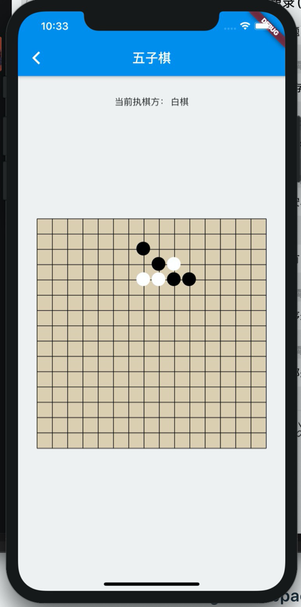
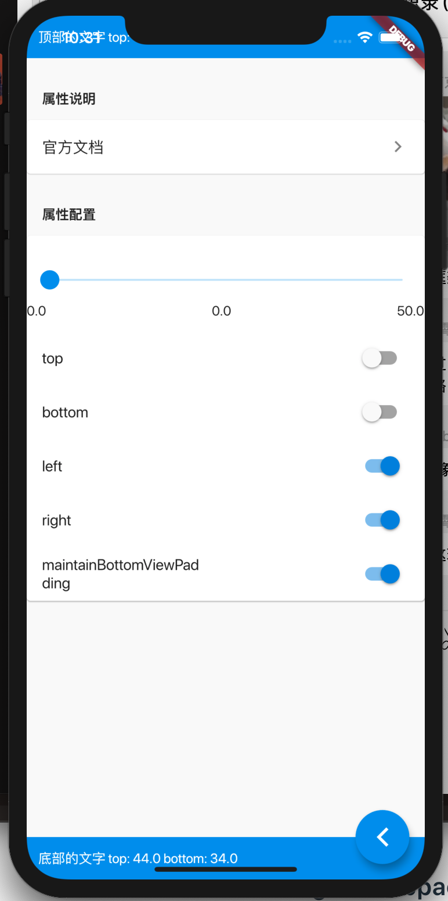
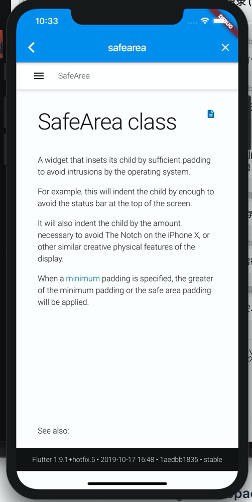

# flutter_study_app

## 安装

1. git clone git@github.com:ma125120/flutter_study_app.git
2. 用 vs code 打开项目，进入 pubspec.yaml 点击保存，自动安装依赖
3. 在 dart 文件内 ctrl + F5，即可进入模拟器进入调试

## 已有功能（或者说 demo）

1. 路由
2. http 请求封装
3. swiper
4. 列表混合，并且可以上拉加载，下拉刷新
5. webview
6. event bus
7. 简易五子棋
8. 页面内滚动至某个节点

## 收获

遇到的问题记录于<a href="note/ch01.md">ch01.md</a>

## 截图

